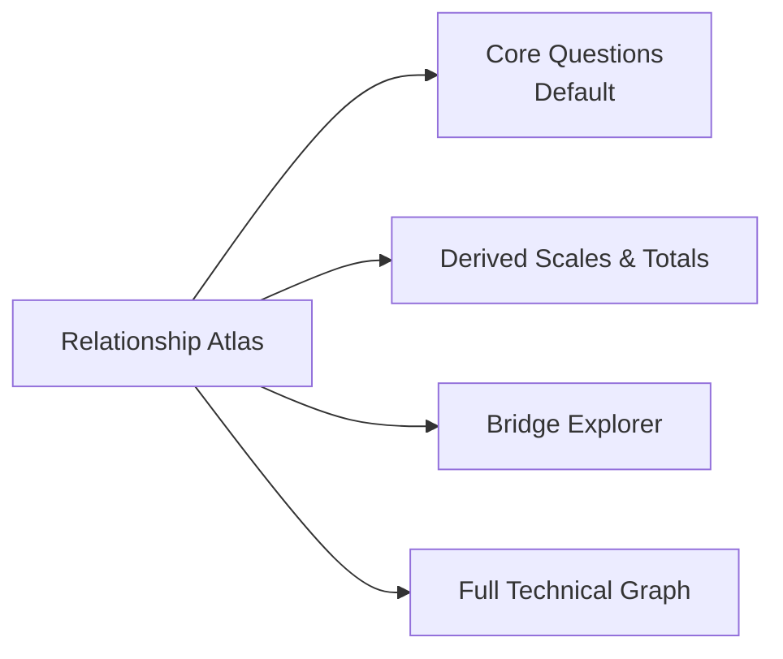

# Relationship Network: Best-Eventual-UX Plan

## Guiding question

**What will create the best eventual user experience for understanding relationships, regardless of implementation effort or timeline?**

---

## Executive summary

The best eventual UX is **not** a single force graph with minor filtering tweaks.

It is a **multi-view “Relationship Atlas”** with purpose-built lenses that share one coherent data model:

1. **Core Questions** (default; most interpretable)
2. **Derived Scales & Totals** (separate analytical layer)
3. **Bridge Explorer** (explicit cross-layer relationships)
4. **Full Technical Graph** (advanced/power-user mode)

This solves the current pain because the underlying data is structurally multi-component; trying to force everything into one canvas creates split layouts, ghost artifacts, and low trust.

---

## Verified ground truth (independent audit)

Audit date: **February 18, 2026**

Data/code inspected:
- `src/lib/schema/relationships.generated.json` (`generatedAt: 2026-02-16T22:26:07.947Z`)
- `scripts/precompute-relationships.mjs`
- `src/routes/relationships.tsx`
- `src/components/charts/network-graph.tsx`

### 1) Current graph has real structural separation

Using the same undirected edge construction as the UI (max per pair):
- **159 nodes**
- **2113 undirected edges**
- **2 disconnected components in full graph**: **134** and **25** nodes

The 25-node component is `cluster-3` (with `bridgesTo: []`) and includes:
- **17 Total:* aggregate nodes**
- plus 8 non-total nodes: `bondageaverage`, `frustration`, `powerlessnessvariable`, and 5 OCEAN-derived variables

So the split is not only a force-layout artifact; the data graph itself is disconnected.

### 2) Default UI behavior is stronger cutoff than most notes assume

In code:
- `networkViewMode` default = `"strong"`
- `DEFAULT_NETWORK_EDGE_MIN = 0.14`
- `STRONG_NETWORK_EDGE_MIN = 0.2`
- Effective cutoff in strong mode = `max(edgeMinValue, strongEdgeValue)` = **0.20**

Implication:
- At **0.14**: 141 visible nodes, 18 ghost nodes
- At **0.20** (default): 109 visible nodes, **50 ghost nodes**

### 3) Rendering currently causes ghost-node artifacts

In `network-graph.tsx`:
- Simulation includes all input nodes/edges.
- Nodes outside visible edge set are still rendered at low alpha (`0.08`) instead of removed.

This is the direct source of “faint floating dots”.

### 4) Data-generation constraints matter

In `precompute-relationships.mjs`:
- Relationships with `|value| <= 0.05` are dropped.
- Per source column, only top **20** relationships are kept.

These constraints improve readability/perf, but they also increase chances of sparse/disconnected topology in the rendered graph.

---

## Why a “small patch” is not enough

### Helpful but insufficient

- Hiding zero-visible nodes fixes visual noise.
- Excluding Totals from default improves first impression.

But:
- Even “non-total only” still contains a disconnected 8-node derived cluster.
- A single mixed-layout canvas still conflates conceptually different entities.

So the eventual best UX requires **information architecture changes**, not just force tuning.

---

## North-star UX principles

1. **Meaning before mechanics**: users should immediately understand what they are looking at.
2. **One question per view**: each view should answer a distinct analytical question.
3. **No hidden visual lies**: don’t fade filtered-out nodes as if they are part of the visible network.
4. **Progressive disclosure**: defaults should be clean; complexity should be opt-in.
5. **State clarity**: always show effective threshold, active scope, and hidden counts.
6. **Layout stability**: avoid dramatic reshuffling when small filters change.

---

## Best eventual UX: “Relationship Atlas”

### A) Core Questions (default)

**Goal:** Help most users discover meaningful preference relationships fast.

- Include interpretable question-level nodes.
- Exclude derived totals/scales by default.
- Hide isolates by default (with explicit counter + reveal control).
- Show component pills if multiple components remain.

### B) Derived Scales & Totals

**Goal:** Explore constructed indices without polluting question map semantics.

- Dedicated map for totals and derived variables.
- Label as “Derived analytics layer” to set expectations.
- Explain that high inter-correlation is partly construction-driven.

### C) Bridge Explorer

**Goal:** Show how layers connect, explicitly and truthfully.

- Render only cross-layer edges (e.g., question↔derived, question↔total).
- Rank by strength and sample size; include short explanations.
- This is where users answer: “How does behavior map to aggregate traits?”

### D) Full Technical Graph (advanced)

**Goal:** Preserve completeness for expert users.

- Keep all node types.
- Keep stronger controls and diagnostics.
- Mark as advanced mode; not primary default.

---

## Required product/UX capabilities

### 1) Explicit scope control

Top-level segmented control (sticky):
- Core Questions (default)
- Derived/Totals
- Bridges
- Full

### 2) Truthful visibility model

- If a node is filtered out, it is not rendered at all.
- Replace ghost dots with status text, e.g.:
  - “50 nodes hidden by current threshold and scope.”

### 3) Effective-threshold communication

Always show:
- slider value
- mode-adjusted effective cutoff
- edges and nodes currently visible

### 4) Component-aware navigation

- Component chips with counts (e.g., `Component A · 102`, `Component B · 19`)
- Click chip to zoom/focus component

### 5) Stable coordinates

- Persist/precompute layouts per view/scope
- Minimize re-layout jitter between small control changes

### 6) Relationship explanation panel

On node/edge selection, show:
- strength, metric, direction
- sample size (`n`)
- top pattern text
- why this edge is shown (scope + threshold context)

---

## Data/model architecture for that UX

### Node typing (first-class)

Every node should carry a stable semantic type:
- `question`
- `derived_scale`
- `aggregate_total`
- `demographic` (if needed)

### Multi-graph artifacts (build-time)

Precompute separate artifacts instead of deriving everything at runtime:
- `coreQuestionsGraph`
- `derivedGraph`
- `bridgeGraph`
- `fullGraph`

Each artifact should include:
- nodes/edges
- connected components
- layout coordinates
- per-node degree and metadata

### Edge retention strategy

Current top-20-per-source is useful but blunt.
Eventual approach should support:
- configurable per-layer retention
- global minimum edge guarantees for component connectivity visibility
- explicit “sparse but connected enough” design targets

---

## Implementation strategy (effort-agnostic, quality-first)

### Phase 1 — Correctness and trust (must-have foundation)

- Never draw filtered-out nodes.
- Simulate only currently rendered nodes/edges.
- Display effective threshold and hidden-node count.
- Fix copy and UI labels to match behavior.

**Success criteria:** No ghost artifacts; controls are truthful.

### Phase 2 — Scope architecture

- Add scope switcher: Core / Derived / Bridges / Full.
- Move “Totals” and similar derived constructs out of default view.
- Ensure each scope has coherent legends and copy.

**Success criteria:** Default view is immediately interpretable and visually coherent.

### Phase 3 — Component-aware UX

- Add component chips + focus behavior.
- Add “show isolates” toggle (off by default).
- Surface why isolates exist.

**Success criteria:** Users are never confused by off-screen or disconnected structures.

### Phase 4 — Precomputed stable layouts

- Compute and ship per-scope coordinates.
- Use deterministic layouts with minor local relaxation for interaction.

**Success criteria:** Layout remains stable across sessions/filter changes.

### Phase 5 — Bridge Explorer + explanation system

- Dedicated cross-layer exploration surface.
- Rich side panel explanations + ranking.

**Success criteria:** Users can answer cross-layer questions without entering full technical mode.

---

## What this means for the old options

- **Hide disconnected nodes**: necessary hygiene, but only part of the solution.
- **Exclude Totals by default**: good direction, but not enough on its own.
- **Add gravity force to pull clusters together**: not recommended as primary strategy (visually misleading).
- **Separate panels**: directionally right; should evolve into coordinated multi-view atlas, not just two static graphs.

---

## Recommended decision

Adopt the **Relationship Atlas** direction as the target UX and treat current fixes as stepping stones.

If we optimize for eventual quality rather than minimal diff size, the right product is:
- **clean default question map**,
- **separate derived/totals analysis layer**,
- **explicit bridge view**,
- and **truthful, stable rendering semantics** across all of them.

---

## Implementation log (February 18, 2026)

### Findings captured during implementation

1. **Semantic node typing is now explicit in UI logic**  
   Derived from schema metadata at runtime:
   - `question`: **130**
   - `derived_scale`: **12**
   - `aggregate_total`: **17**

2. **Scope topology confirms why a single default graph is confusing**
   - Core scope (`question` only) still has a disconnected singleton component.
   - Derived scope has multiple disconnected components.
   - Bridge scope is sparse and can create many isolates at higher thresholds.

3. **Ghost artifacts were caused by visibility/render mismatch**
   - The previous graph drew nodes at low alpha when filtered out.
   - Rendering now removes filtered nodes entirely.

### Implemented changes

#### `src/components/charts/network-graph.tsx`
- Added shared `getEffectiveNetworkEdgeCutoff()` utility for one source of truth.
- Added `showIsolates` prop.
- Simulation now runs on **only currently visible nodes/edges**.
- Removed ghost-node rendering behavior (filtered nodes are no longer drawn).
- Preserved layout cache by node id while still simulating visible subsets.

#### `src/routes/relationships.tsx`
- Implemented top-level atlas scope switcher:
  - Core questions (default)
  - Derived + totals
  - Bridge explorer
  - Full graph
- Added semantic node-type classifier (`question`, `derived_scale`, `aggregate_total`).
- Added scope-aware edge filtering and relationship-card filtering.
- Added truthful threshold/status copy:
  - slider value
  - effective cutoff (including strong-mode floor)
  - visible links/nodes
  - hidden node counts
- Added isolate behavior controls:
  - isolates hidden by default
  - explicit `Show isolates` toggle
- Added connected-component chips with focus filtering.
- Restricted focus combobox options to current scope.
- Prevented stale selection when switching to a scope that excludes the selected node.

### Validation

- `pnpm check-types` ✅
- `pnpm test --run` ✅ (existing Vitest hanging-process notice still appears after successful completion)
- `pnpm build` ✅

### Post-implementation review findings

- Reviewed with Oracle (`mode: review`) for regression pass.
- Addressed follow-up UX clarifications in code:
  - explicit comment that graph receives pre-filtered edges/nodes from route-level scope logic
  - hidden-count messaging now distinguishes filter-driven hiding vs focused-component hiding
  - bridge-scope empty-state copy clarifies cross-layer-only semantics

### Remaining toward full north-star

- Phase 4 precomputed per-scope stable layouts is not yet implemented (current behavior is deterministic cached force layout, not shipped precomputed coordinates).
- Phase 5 dedicated bridge explanation/ranking panel is not yet implemented as a separate surface.
